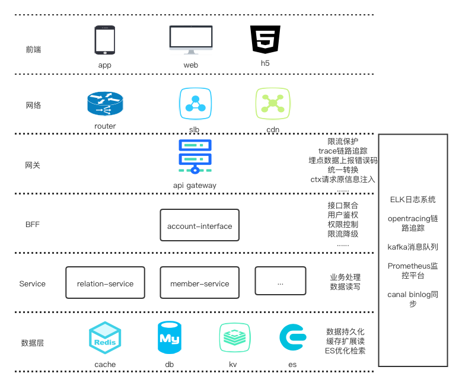
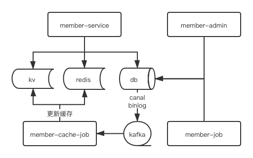
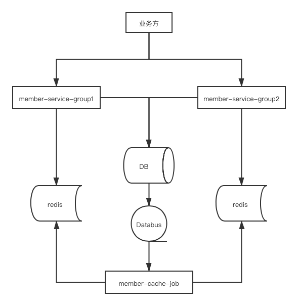

## 用户信息系统

### 整体架构图


### 业务层架构



- member-service: 业务处理
- member-admin: 管理员操作
- member-job: 定时task、外部消息处理
- member-cache-job: 更新kv、redis的缓存
- db: 数据持久化，一主多从
- redis: 一级缓存，随机期限失效
- kv: 二级缓存，持久化，承担读压力

### 多集群缓存更新策略

member-service因业务量大，可用性要求高，需部署多个集群：
- 共享同一个mysql主库
- 从库隔离，分担读压力
- redis、kv等缓存组件隔离，采用不同集群
- cache-job根据binlog**强制**更新kv、redis缓存
- service缓存miss时，使用**cas**添加缓存，防止覆盖cache-job更新的缓存



### 目录结构

**详见https://github.com/zhuangqf-sysu/HelloWorld**

#### 目录结构
```go 
├─api           \\ 存放对外api、error等
├─cmd           \\ main函数 wire
├─configs       \\ 配置文件 -todo-> 配置中心
├─internal      \\ 内部使用
│  ├─config     \\ 配置
│  ├─dao        \\ 数据层
│  ├─model      \\ model定义
│  ├─repo       \\ repo 每个domain对应一个repo
│  ├─server     \\ 相当于mvc的controller
│  └─service    \\ 处理业务逻辑
└─test          \\ 测试

```

- api 存放api、error等pd文件，对外
    - api.pb 说明了服务对外输出的接口
    - error.pb 定义了本服务对外的错误码  
- cmd 提供main方法启动服务，wire文件也放在这里
- config 配置相关
- repo 相当于dao，包装db、cache等存储细节，统一提供对外的crud方法，所以用repo语义更贴切
- model 定义模型，相比于贫血模型，个人更喜欢model能符合开闭原则，做些力所能及的事，详见代码
- server 相当于mvc的controller, 主要是依赖service实现api接口
- service 业务处理（相对于biz,个人认为service更为贴切或者说熟悉）

#### 依赖倒置

